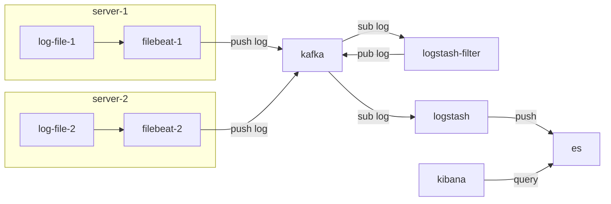

# ELK分布式日志收集


<!--more-->

## ELK 架构

[文档](https://www.elastic.co/guide/index.html)




## 配置ES

修改文件`config/elasticsearch.yml`

- path.data
- path.logs
- network.host
- http.port

生成相应账户密码
- `./bin/elasticsearch-reset-password -u elastic`
- `./bin/elasticsearch-reset-password -u kibana-system`


## 配置Kibana

- server.port
- server.host
- elasticsearch.username
- elasticsearch.password
- i18n.locale


## 配置Kafka

新建 `config/kafka_server_jass.conf`

```conf
KafkaServer {
  org.apache.kafka.common.security.plain.PlainLoginModule required
    username="admin"
    password="admin-password"
    user_admin="admin-password"
    user_tom="tom-password";
};
KafkaClient {
  org.apache.kafka.common.security.plain.PlainLoginModule required
    username="admin"
    password="admin-password"
    user_admin="admin-password"
    user_tom="tom-password";
};
Client {
  org.apache.kafka.common.security.plain.PlainLoginModule required
    username="admin"
    password="admin-password"
    user_admin="admin-password";
};
Server {
  org.apache.kafka.common.security.plain.PlainLoginModule required
    username="admin"
    password="admin-password"
    user_admin="admin-password";
};
```

修改 `bin/kafka-server-start.sh`, 最后一行前添加 `export KAFKA_OPTS="-Djava.security.auth.login.config=$base_dir/../config/kafka_server_jaas.conf"`

新建 `config/tom-client.conf`

```conf
sasl.jaas.config=org.apache.kafka.common.security.plain.PlainLoginModule \
    required username="tom" password="tom-password";
security.protocol=SASL_PLAINTEXT
sasl.mechanism=PLAIN
```

测试执行命令 `./bin/kafka-topics.sh --bootstrap-server ip:port --command-config config/tom-client.conf --list`


---

> 作者: ingbyr  
> URL: https://ingbyr.github.io/posts/elk%E5%88%86%E5%B8%83%E5%BC%8F%E6%97%A5%E5%BF%97%E6%94%B6%E9%9B%86/  

