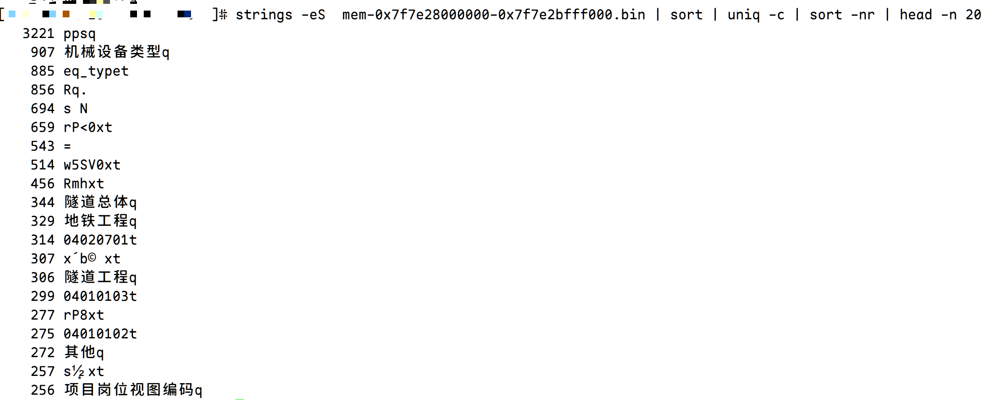

# 一次JVM堆外内存问题排查


记录一下JVM堆外内存泄露排查的过程

<!--more-->

## 出现的问题

线上运行的Java应用在持续运行数小时后会因堆外内存不足而终止，查看日志可以看到类似输出：


先尝试了使用手动释放cached memory，发现还有大量内存未释放，基本排除了操作系统内存释放策略配置错误的问题


## 开启JVM堆外内存追踪

在启动Java应用的参数中添加 `-XX:NativeMemoryTracking=detail`
，重启应用后运行一段时间，使用 `jcmd $pid VM.native_memory summary`
查看内存分配情况，可以看到类似输出


与 top 命令输出的 RSS 比对发现远小于其值，此时基本可以确定是 JNI 调用 Native Code 导致的堆外内存泄露

## 查看未释放的堆外内存内容

1. 先使用 `pmp -x $pid` 查看内存分布情况，对比前后两次的内容发现一直会申请一些64MB的内存块，并且始终处于未释放状态
2. 查看 `/proc/$pid/smaps` 或 `/proc/$pid/maps` 找到对应内存起始和终止地址
3. 使用 `gdb -pid $pid` attach 到问题进程， `dump memory mem.bin 起始地址 终止地址` dump 出对应的多块内存块。
4. 由于此次Java应用中存在中文字符，因此使用 `strings -eS mem.bin` 查看可显示的字符内容



经查看多个内存块后发现出现频率高的字符串没有明显规律，需要进一步排查

## 监控内存分配

本次使用 [Jemalloc](https://github.com/jemalloc/jemalloc) 分析应用内存分配情况，首先在应用启动环境添加

```bash
export LD_PRELOAD=/usr/local/lib/libjemalloc.so
export MALLOC_CONF=prof:true,lg_prof_interval:31,prof_prefix:/root/jeprof-result/app
```

重启应用后等待 Jemalloc 输出内存采样文件，查看多个采样文件后发现端倪


可以看到 `524336   0.1% 100.0%  7386790   0.8% Java_java_util_zip_Inflater_init` JNI调用

## 定位问题代码

使用 `jstack $pid | grep Inflater` 查找调用栈（可能需要多次）


发现在 Redis 序列化与反序列时使用了 JDK 中的 ZLIB 压缩算法，查看源码可以看到未调用 `stream.close()`
`infalter.end()` 和 `defalter.end()`方法


顺便确认下 native code 调用


## 修改问题代码

直接看代码


---

> 作者: ingbyr  
> URL: https://ingbyr.github.io/posts/jvm-native-memory-leak/  

