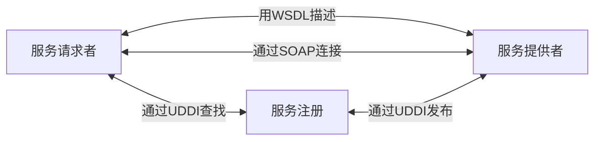

# 系统架构师考试12 下篇内容合集

<!--more-->

## 信息系统架构设计

### 分类

- 物理结构
    - 集中式结构
    - 分布式结构
        - 一般分布式
        - 客户机/服务器
- 逻辑结构
    - 横向综合
    - 纵向综合
    - 横纵综合

### 常用架构模型

- 单机应用模式
- 客户机/服务器模式
    - 2层C/S
        - 前台界面/服务
        - 数据库
    - 3层C/S
        - 前台界面
        - 后台服务
        - 数据库
    - 多层C/S
        - 前台界面
        - Web服务器
        - 中间件/应用层
        - 数据库
        - MVC
    - 面向服务架构（SOA）模式：本质是消息机制或远程过程调用（RPC）
    - 企业数据交换总线（ESB）

### 总体框架

- 战略系统（战略管理）
- 业务系统，应用系统（战术管理）
- 信息基础设施（运行管理）

### 信息系统架构设计方法

- ADM架构开发方法：
    - TOGAF 开放式企业架构框架标准
    - 通用基础架构 -> 行业架构 -> 组织特定架构
    - 阶段
        - 准备阶段
        - 需求管理
        - 架构愿景
        - 业务架构
        - 信息系统架构（应用和数据）
        - 技术架构
        - 机会和解决方案
        - 迁移规划
        - 实施治理
        - 架构变更管理
- 信息化总体架构方法
    - 信息化特征
        - 易用性
        - 健壮性
        - 平台化、灵活性、拓展性
        - 安全性
        - 门户化、整合性
        - 移动性
    - 信息化工程建设方法
        - 架构模式
            - 数据导向架构：主数据管理MDM
            - 流程导向架构：SOA
        - 生命周期
            - 系统规划阶段：调查，确定发展战略，可行性分析，导出系统设计任务书
            - 系统分析阶段：提出逻辑模型，关键阶段，系统说明书
            - 系统设计阶段：提出物理模型，系统设计说明书
            - 系统运行和维护阶段：
        - 总体规划方法论
            - 关键成功因素法：找出关键因素集合，确定系统开发的优先次序，主要矛盾
            - 战略目标集转化法：把组织的战略目标转换为管理信息系统的战略目标，较全面，但突出重点不如关键成功因素法
            - 企业信息系统规划法：自上而下地识别系统目标、企业过程和数据，分析后自上而下设计信息系统

## 层次式架构设计理论

- 核心思想：将系统组成为一种层次结构，每一层为上层服务，并作为下层客户
- 特性：关注点分离

### 常用层次式架构

- 表现层
    - MVC模式
        - 模型 Model：业务数据和业务逻辑
        - 视图 View：交互界面，可与Model、Controller交互
        - 控制器 Controller： 接受用户请求，调用Model响应请求，选择View显示结果
    - MVP模式 （View <-> Presenter <-> Model ）
        - Model：
        - View：显示
        - Presenter：逻辑处理
    - MVVM模式
        - Model：被观察者
        - View：观察者
        - ViewModel： 双向绑定
- 中间层
    - 业务逻辑层组件设计：Web层与后台业务层松耦合
    - 业务逻辑层工作流设计：应用逻辑于过程逻辑分离
    - 业务逻辑层实体设计：
    - 业务逻辑层框架
- 访问层
    - 数据访问模式
        - 在线访问模式
        - DataAccess Object （DAO）
        - DataTransfer Object （DTO）
        - 离线数据模式
        - 对象/关系映射
    - ORM：Hibernate
    - 数据库连接池
    -
- 数据层

## 物联网层次架构设计

- 感知层：数据获取
- 网络层：传递信息，处理信息
- 应用层：信息处理和人机交互

## 云原生架构

- 基于云原生技术的一组架构原则和设计模式的集合
- 将云应用中的非业务代码`部分`最大化剥离，由云设施接管
- 特点
    - 代码结构发生巨大变化
    - 非功能特性大量委托
    - 高度自动化的软件交付
- 原则
    - 服务化原则
    - 弹性原则
    - 可观测原则
    - 韧性原则：服务异步化能力、重试/ 限流/降级/熔断/反压、 主从模式、集群模式、 AZ 内的高可用、单元化、跨region容灾、异 地多活容灾等
    - 过程自动化
    - 零信任原则
    - 架构持续演进原则

### 主要架构模式

- 服务化架构：接口契约如IDL定义业务关系，标准协议（HTTP、gPRC）提供互联互通
- Mesh化架构模式：中间件框架从业务进程分离
- Serverless模式：适合事件驱动的数据计算任务、计算时间短的请求/相应应用、没有复杂相互调用的长周期任务
- 存储计算分离模式
- 分布式事务模式
    - XA：强一致性，性能较差
    - 基于消息的最终一致性BASE：性能高，通用性有限
    - TCC：侵入性强，开发维护成本高
    - SAGA：反向补偿事务，开发维护成本高
    - SAGA AT：高性能，无代码开发工作量，特定数据库适用
- 可观测架构
    - Logging：日志详细详细信息跟踪
    - Trace：一个请求完整调用链路跟踪
    - Metrics：系统量化的多维度度量
- 事件驱动架构
- 反模式
    - 庞大的单体应用
    - 硬拆分微服务
    - 缺乏自动化能力的微服务

### 云原生相关技术

- 容器技术
    - 虚拟化至OS级别，软件
    - 虚拟机技术则虚拟化至硬件级别
- 容器编排
    - 事实标准：Kubernetes
    - 资源调度
    - 应用部署与管理
    - 自动修复
    - 服务发现与负载均衡
    - 弹性伸缩
    - 声明式API
    - 可扩展性架构
    - 可移植性
- 云原生微服务
    - 微服务个体约束：按照问题域对单体应用做合理拆分
    - 微服务之间的横向关系：可发现性，可交互性
    - 微服务与数据层的纵向约束：无状态服务，有状态服务使用计算与存储分离方式
    - 微服务分布式约束
        - 高效自动化运维
        - 全链路、实时和多维度的可观测能力
        - 中心化的监控系统，多维度展示
- 无服务器技术（Serverless）
    - 后端云服务 BaaS
    - 全托管的计算服务，通用性，自动弹性伸缩，按量计费
        - 产品代表：函数计算（Function as a Service，FaaS）
    - 技术关注点
        - 计算资源弹性调度
        - 负载均衡和流控
        - 安全性
- 服务网格
    - 非功能性从业务进程剥离到另外进程，无侵入性
    - Istio
        - 控制平面 Istiod
            - Pilot：提供服务发现，智能路由流量管理（A/B测试，金丝雀发布），弹性功能（超时、重试、熔断器等）
            - Citadel：身份和证书管理，身份验证，流量加密
            - Galley：配置验证、提取、处理和分发
        - 数据平面 Envoy（Sidecar模式部署）
            - 动态服务发现
            - 负载均衡
            - TLS终端
            - HTTP/2 与 gRPC 代理
            - 熔断器
            - 健康检查
            - 基于百分比流量分割的分阶段发布
            - 故障注入
            - 指标
    - Linkerd, Consul，Conduit

## 面向服务架构设计

### SOA

- UDDI
- WSDL
- SOAP
- REST
