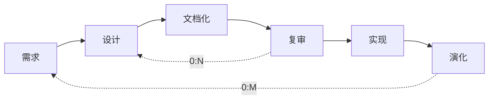

# 系统架构师考试7-系统架设计基础知识

<!--more-->

# 软件架构概念

## 定义

- 系统的一个或多个结构
- 结构包括软件的构件、构件外部可见属性和构件之间的相互关系
- 设计的两个层次
    - 数据设计
        - 传统体系结构的数据构件
        - 面向对象系统中类的定义（封装属性和操作）
    - 体系结构设计
        - 软件的结构、属性和交互作用
- 构件软件的初始蓝图

## 架构设计生命周期

- 需求分析
    - 需求分析对应问题空间，结构设计（SA）对应解空间
    - 可追踪性：表格或 Use Case Map
    - 可转换性：词法分析，经验规则
- 设计（SA重点阶段）
    - 构件与连接子
    - ADL体系结构描述语言：UniCon、Rapide、Darwin ...
    - 多视图表示
- 实现
    - 开发过程：项目组织结构、配置管理
    - 向实现过渡途径：SA阶段、模型映射、构件组装、复用中间平台
    - 基于SA的测试技术
    - SA与底层实现
        - SA引入实现阶段
        - SA模型转换技术： 高到低
        - 封装底层实现细节：较大粒度构件，低到高
- 构件组装
    - 中间件工业标准：CORBA、J2EE、COM
    - 失配问题
        - 构件失配：构件基础设施、控件模型和数据模型
        - 连接子失配：构件交互协议、连接子数据模型
        - 对全局体系结构的假设存在冲突
- 部署
- 后开发
    - 维护、演化、复用
    - 动态软件体系结构
        - 内部执行导致
        - 外部请求对软件重新配置
    - 恢复与重建
        - 手工重建
        - 工具重建
        - 查询语言自动建立聚集
        - 其他技术：数据挖掘

## 系统架构的重要性

- 满足系统品质
- 使受益人达成一致的目标
- 支持计划编制过程
    - 细节换分、日程安排、工作分配
    - 成本分析、风险管理、技能开发
- 对系统开发的指导性
- 有效地管理复杂性
- 奠定复用基础
- 降低维护费用
- 支持冲突分析

# 基于架构的开发方法

## 基于体系结构的软件设计（ABSD）

### 概述

- ABSD由体系结构驱动，指由构成体系结构的商业、质量和功能需求的组合驱动的
- 从项目总体功能框架明确就开始的，与需求抽取和分析活动并行
- 3个基础
    - 功能的分解：基于模块的内聚和耦合技术
    - 选择体系结构风格来实现质量和商业需求
    - 使用软件模板
- 递归的，每个步骤清晰定义，有助于降低体系结构设计的随意性

### 概念与术语

- 设计元素：自顶向下，递归细化，得到软件构件和类
    - 第一层：系统
    - 第二层：概念子系统
    - 第三层：概念构件
    - 最后映射至实际构件
- 视角与视图
    - 不同视角，不同属性
- 用例和质量场景
    - 用例捕获功能需求
    - 场景（质量场景）捕获质量需求

## 基于体系结构的开发模型

