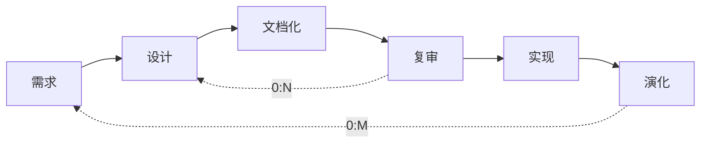
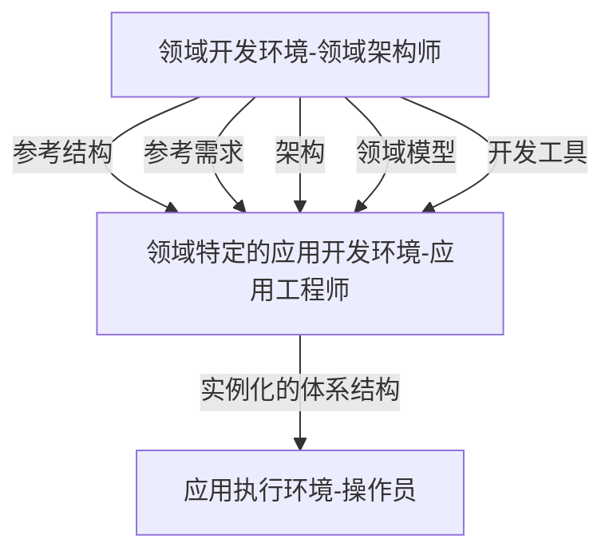

# 系统架构师考试7-系统架设计基础知识

<!--more-->

## 软件架构概念

### 定义

- 系统的一个或多个结构
- 结构包括软件的构件、构件外部可见属性和构件之间的相互关系
- 设计的两个层次
    - 数据设计
        - 传统体系结构的数据构件
        - 面向对象系统中类的定义（封装属性和操作）
    - 体系结构设计
        - 软件的结构、属性和交互作用
- 构件软件的初始蓝图

### 架构设计生命周期

- 需求分析
    - 需求分析对应问题空间，结构设计（SA）对应解空间
    - 可追踪性：表格或 Use Case Map
    - 可转换性：词法分析，经验规则
- 设计（SA重点阶段）
    - 构件与连接子
    - ADL体系结构描述语言：UniCon、Rapide、Darwin ...
    - 多视图表示
- 实现
    - 开发过程：项目组织结构、配置管理
    - 向实现过渡途径：SA阶段、模型映射、构件组装、复用中间平台
    - 基于SA的测试技术
    - SA与底层实现
        - SA引入实现阶段
        - SA模型转换技术： 高到低
        - 封装底层实现细节：较大粒度构件，低到高
- 构件组装
    - 中间件工业标准：CORBA、J2EE、COM
    - 失配问题
        - 构件失配：构件基础设施、控件模型和数据模型
        - 连接子失配：构件交互协议、连接子数据模型
        - 对全局体系结构的假设存在冲突
- 部署
- 后开发
    - 维护、演化、复用
    - 动态软件体系结构
        - 内部执行导致
        - 外部请求对软件重新配置
    - 恢复与重建
        - 手工重建
        - 工具重建
        - 查询语言自动建立聚集
        - 其他技术：数据挖掘

### 系统架构的重要性

- 满足系统品质
- 使受益人达成一致的目标
- 支持计划编制过程
    - 细节换分、日程安排、工作分配
    - 成本分析、风险管理、技能开发
- 对系统开发的指导性
- 有效地管理复杂性
- 奠定复用基础
- 降低维护费用
- 支持冲突分析

## 基于架构的开发方法

### 基于体系结构的软件设计（ABSD）

- ABSD由体系结构驱动，指由构成体系结构的商业、质量和功能需求的组合驱动的
- 从项目总体功能框架明确就开始的，与需求抽取和分析活动并行
- 3个基础
    - 功能的分解：基于模块的内聚和耦合技术
    - 选择体系结构风格来实现质量和商业需求
    - 使用软件模板
- 递归的，每个步骤清晰定义，有助于降低体系结构设计的随意性
- 设计元素：自顶向下，递归细化，得到软件构件和类
    - 第一层：系统
    - 第二层：概念子系统
    - 第三层：概念构件
    - 最后映射至实际构件
- 视角与视图
    - 不同视角，不同属性
- 用例和质量场景
    - 用例捕获功能需求
    - 场景（质量场景）捕获质量需求

### 基于体系结构的开发模型

- 需求
    - 需求获取
        - 系统质量目标
        - 系统商业目标
        - 系统开发人员商业目标
    - 标识构件
        - 生成类图
        - 对类进行分组
        - 把类打包成构件
    - 需求评审
- 体系结构设计
    - 提出体系结构模型
    - 映射构件
    - 分析构件相互作用
    - 产生体系结构
    - 设计评审
- 体系结构文档化
    - 体系结构规格说明
    - 测试体系结构需求的质量设计说明书
    - 从使用者角度编写
- 体系结构复审
    - 外部人员
    - 用户代表和领域专家
    - 标识潜在风险
- 体系结构实现
    - 分析与设计
    - 构件实现
    - 构件组装
    - 系统测试
- 体系结构演化
    - 需求变化归类
    - 演化计划
    - 构件变动
    - 更新构件相互作用
    - 构件组装与测试
    - 技术评审

## 软件架构风格

### 概述

- 描述某一特定应用领域中系统组织方式的惯用模式
- 定义一个系统家族
    - 一个词汇表：包含一些构件和连接件类型
    - 一组约束：如何将这些构件和连接件组合起来

### 分类

- 数据流风格
    - 批处理风格：前后串行，数据完整传递
        - 基本构件：独立应用程序
        - 连接件：某种类型媒介，定义了数据流图
    - 管道-过滤器风格: 数据流式处理（可分叉并发）
        - 基本构件：过滤器
        - 连接件：数据流传输管道
- 调用返回风格
    - 主程序/子程序风格
    - 面向对象风格
    - 层次型风格
    - 客户端/服务器风格（C/S）
        - 2层：胖客户机，瘦服务器
        - 3层：瘦客户机
            - 表示层：用户接口（图形用户界面）
            - 功能层：业务处理逻辑
            - 数据层：数据库管理系统
- 以数据为中心风格
    - 仓库风格
    - 黑板风格
        - 解决复杂的非结构化问题
        - 常用于信号处理领域，语音识别和模式识别
- 虚拟机风格
    - 解释器风格
        - 解释器引擎，引擎内部状态，被解释执行的程序，程序执行状态
        - 执行效率较低，例如专家系统
    - 规则系统风格
        - 规则集，规则解释器，规则/数据选择器，工作内存
- 独立构件风格
    - 进程通信风格
        - 构件：独立进程
        - 连接件：消息传递
    - 事件系统风格
        - 基于事件的隐式调用风格，触发或广播一个或多个事件
        - 事件源，事件管理器，事件处理器
        - 常见场景
            - IDE多操作联动
            - DBMS确保数据一致性
            - 用户界面系统管理数据库
            - IDE中语法检查debug

## 软件架构复用

- 软件产品线
    - 一组软件密集型系统，共享一个公共的、可管理的特性集
    - 满足某个特定市场或人物的具体需要
    - 以规定的方式用公共的核心资产继承开发出来
- 核心资产库
    - 软件架构
    - 设计方案及文档、用户手册、项目管理历史记录（预算和进度）、测试计划与测试用例
- 作用
    - 复用核心资产（软件架构）
    - 提高生产效率
    - 降低生产成本
    - 缩短上市时间
- 软件复用：开发椅子基本的软件构造模块
    - 机会复用：开发中发现复用机会
    - 系统复用：开发前规划决定复用
- 可复用资产
    - 需求
    - 架构设计
    - 元素
    - 建模与分析
    - 测试
    - 项目规划
    - 过程、方法和工具
    - 人员
    - 样本系统：演示原型
    - 缺陷消除
- 复用的基本过程
    - 构造可复用资产
    - 入库到 可复用资产库（构件库）
        - 存储、管理、检索浏览与维护
    - 从中选择、定制、组装后复用这些资产

## 特定领域软件体系结构（DSSA）

### 定义

- 在一组相关的应用中共享软件体系结构
- 在一个特定应用领域中为一组应用提供组织结构参考的标准软件体系结构
- 垂直域：一个特定的系统族
- 水平域：在多个系统（族）中（部分）功能区域的共有部分

### 基本活动

> 反复的、逐渐求精的过程

- 领域分析
    - 获得领域模型：描述领域中系统之间的共同需求
    - 定义领域边界
    - 识别信息源：现存系统、技术文献、问题与和系统开发的专家
    - 分析需求：广泛共享从而建立领域模型
- 领域设计
    - 获得DSSA：描述在领域模型中标识的需求的解决方案
- 领域实现
    - 依据领域模型和DSSA开发和组织可重用信息

### DSSA人员

- 领域专家
- 领域分析人员：提取知识到领域模型
- 领域设计人员：开发出DSAA
- 领域实现人员：依据领域模型和DSSA，得到可重用构件

### DSSA建立过程

> 并发的、递归的、反复的，即螺旋模型

- 定义领域范围
- 定义领域特定的元素
- 定义领域特定的设计和实现需求约束
- 定义领域模型和体系结构
- 产生、搜集可重用的产品单元

DSSA三层次系统模型

