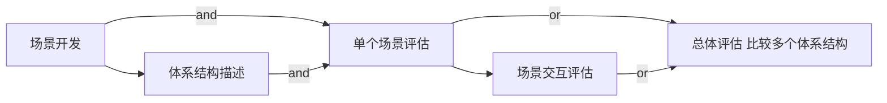
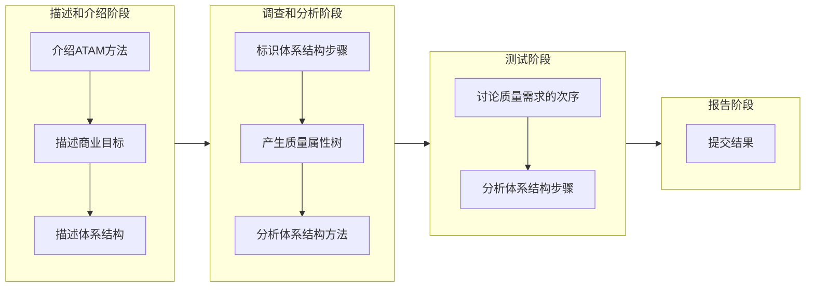

# 系统架构师考试8-系统质量属性与架构评估

<!--more-->

## 软件系统质量属性（QA）

- 软件系统与明确或隐含地定义的需求一致的程度
- 可测量、可测试的属性，描述系统满足利益相关者需求的程度
- 开发期质量属性
- 运行期质量属性
- 面向架构评估的质量属性
    - 性能：定量表示，性能测试常使用基准测试程序
    - 可靠性：维持软件系统的功能特性的基本能力
        - MTBF = MTTF + MTTR
        - 容错：内部修复
        - 健壮性：确保按某种预定义方式终止执行
    - 可用性：系统能够正常运行的时间比例
    - 安全性
        - 机密性：不泄露给非授权用户
        - 完整性：信息完整和准确，防止非法修改
        - 不可否认性：双方不能否认收发消息的行为
        - 可控性：对信息的传播及内容具有控制能力
    - 可修改性
        - 可维护性：问题修复
        - 可扩展性
        - 结构重组
        - 可移植性
    - 功能性
    - 可变性
    - 互操作性
- 质量属性场景
    - 刺激源
    - 刺激
    - 环境：运行环境
    - 制品：系统或其中一部分
    - 响应
    - 响应度量

## 系统架构评估

- 基于调查问卷或检查表的方法
    - 缺点：依赖于评估人员的主观推断
- 基于场景的评估方法
    - 应用于架构权衡分析法（ATAM）和软件架构分析方法（SAAM）中
- 基于度量的评估方法
    - 建立质量属性与度量之间之间的映射原则

### 重要概念

- 敏感点
    - 一个或多个构件（和构件或构件之间的关系）的特性
- 权衡点
    - 影响多个质量属性的特性，是多个质量属性的敏感点
    - 例如安全性与性能
- 风险点
- 非风险点
- 场景
    - 从风险承担着的角度
    - 刺激、环境、响应

### 系统架构评估方法

- SAAM 基于场景的评估方法
    - 评估主要目标质量属性为可修改性
    - 基于场景，目标为描述应用程序属性的文档
    - 主要输入问题描述、需求说明和架构描述

- `ATAM 架构权衡分析方法`
    - 基于SAAM
    - 主要关注
        - 性能
        - 安全性
        - 可修改性
        - 可用性
    - 多个属性之间折中
    - 活动过程
        - 场景和需求收集：收集场景，需求，约束，环境
        - 体系结构视图和场景实现：描述体系结构视图，实现场景
        - 属性模型构造和分析：特定属性分析（优秀的单一理论）
        - 折中：标志折中，标志敏感度
    - 效用树
        - 树根 -- 质量属性 -- 属性分类 -- 质量属性场景（叶子节点）
        - 按场景排定优先级
            - （H/M/L，H/M/L）
            - （重要性，实现的难易程度）

- CBAM 成本效益分析法
    - 对架构设计决策的成本和收益进行建模
    - 在ATAM结束时开始，利于ATAM的结果
    - 依据 ROI 投资回报 选择架构策略
- SAEM 软件体系结构分析方法
    - Software Architecture Analysis Method
    - 评估软件系统的质量属性和架构决策的有效性
    - 外部质量属性、内部质量属性
- SAABNet
    - Bayesian Belief Networks
    - 来源于人工智能，贝叶斯网络
    - 定性评估
- SACMM
    - Software Architecture Change Management Model
    - 软件架构修改的度量方法
- SASAM
    - Software Architecture Static Analysis Method
    - 对预期架构和实际架构进行映射和比较，静态地评估SA
- ALRRA
    - Architecture Level Reliability Risk Assessment
    - 软件架构可靠性风险评估方法
- AHP
    - Analytical Hierarchy Process 层次分析法
    - 将复杂问题分层，两两对比，主观判断结构
- COSMIC+UML
    - 面向对象系统源代码的可维护性度量
