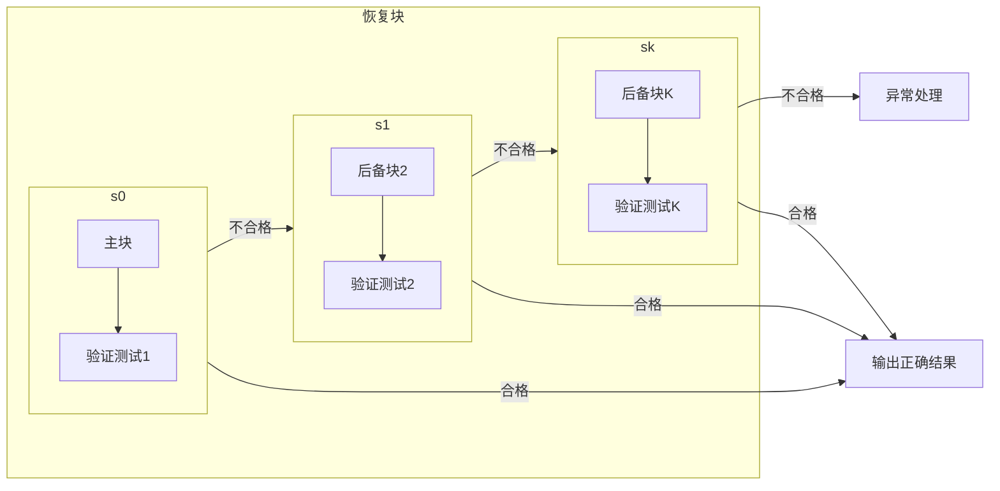
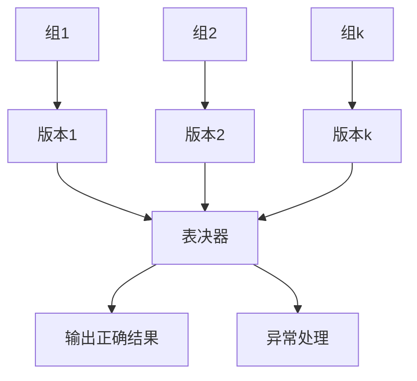

# 系统架构师考试9-软件可靠性

<!--more-->

## 软件可靠性概念

### 定义

软件产品在规定的条件下和规定的事件区间完成规定功能的能力

- 规定的条件：计算机系统的状态和软件的输入条件（运行时外部输入条件）
- 规定的时间区间：实际运行时间区间
- 规定的功能：为提供服务所必须具备的功能
- 软件与硬件的可靠性特点

| 特点     | 软件 | 硬件  |
|--------|----|-----|
| 复杂性    | 高  | 低   |
| 物理退化   | 无  | 有   |
| 唯一性    | 唯一 | 不唯一 |
| 版本更新频率 | 快  | 慢   |

### 定量

- 平均无故障时间 MTTF，失效率是MTTF的倒数
- 平均故障修复时间 MTTR，修复率是MTTR的倒数
- 平均故障间隔时间 MTBF = MTTR + MTTF
- 系统可用性，MTTF / (MTTR + MTTF) = MTTF / MTBF
- 串联可靠性
    - R = R1 x R2 x ... x Rn
- 并联可靠性
    - R = 1 - (1 - R1) x (1 - R2) x ... x (1 - Rn)

## 可靠性建模

软件可靠性模型：为预计或估算软件的可靠性所建立的可靠性框架和数学模型

好的建模：

- 基于可靠的假设
- 简单
- 计算有用的量
- 给出未来失效行为的好的映射
- 可广泛应用

## 可靠性设计

### 容错技术

- 恢复块设计
    - 串行
    - 前向恢复：使当前的计算继续下去，把系统恢复成连贯的正确状态，弥补当前状态的不连贯情况
    - 后向恢复：系统恢复到前一个正确状态，继续执行

- N版本程序设计
    - 并行
    - 多数表决

| 区别指标   | 恢复块方法  | N版本程序设计 |
|--------|--------|---------|
| 硬件运行环境 | 单机     | 多机      |
| 错误检测方法 | 验证测试程序 | 表决      |
| 恢复策略   | 后向恢复   | 前向恢复    |
| 实时性    | 差      | 好       |

- 冗余设计
    - 在一套完整的软件系统之外， 设计一种不同路径、不同算法或不同实现方法的模块或系统作为备
- 双机模式是集群的前身。双机模式有以下几种：
    - 双机热备模式（主系统、备用系统）
    - 双机互备模式（同时提供不同的服务，心不跳则接管）
    - 双机双工模式（同时提供相同的服务，集群的一种）
- 防卫式程序设计
    - 对于程序中存在的错误和不一致性，通过在程序中包含错误检查代码和错误恢复代码，使得一旦错误发生，程序能撤销错误状态，恢复到一个已知的正确状态中去。如
      try-catch。
    - 实现策略：错误检测、破坏估计、错误恢复。

### 检错技术

- 实现代价一般低于容错和冗余技术
- 不能自动解决故障

### 降低复杂度设计

保证实现软件功能的基础上，简化软件结构

